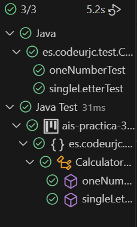
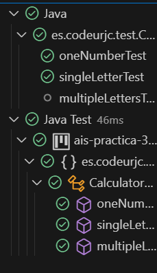
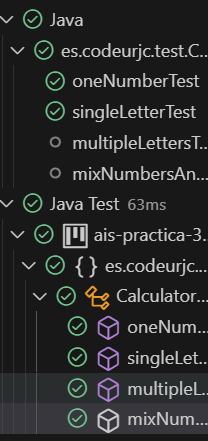
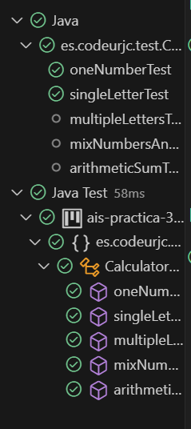
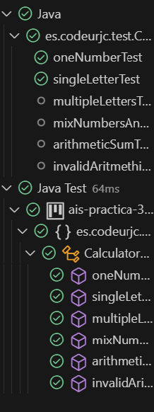

# CalculatorParser TDD

## Authors
- Alfonso Rodríguez Gutt.
- Marc Burgos Ucendo.

## Table of Contents
- [Expression with Letters Test](#expression-with-letters-test)
- [Expression with Multiple Letters Test](#expression-with-multiple-letters-test)
- [Mix Numbers and Letters Test](#mix-numbers-and-letters-test)
- [Arithmetic Sum Test](#arithmetic-sum-test)
- [Invalid Arithmetic Sum Test](#invalid-arithmetic-sum-test)
- [Example 7](#example-7)
- [Example 8](#example-8)
- [Example 9](#example-9)
- [Example 10](#example-10)
- [Example 11](#example-11)
- [Example 12](#example-12)
- [Example 13](#example-13)
- [Example 14](#example-14)
- [Example 15](#example-15)
- [Example 16](#example-16)
- [Example 17](#example-17)
- [Refactorization](#refactorization)

>[!NOTE]
> Since all tests are intended to test the functionality of a single method, the refactoring of both the tests and the parser method will be shown in a separate section, showing the refactorings together along with proof that all the tests pass.

## Expression with Letters Test

### Test Code
````java
private static final String ERROR_MESSAGE = "The expression received is not a number.";
````

````java
@Test
@DisplayName("When receiving an expression with a letter, a NumberFormatException should be thrown")
public void singleLetterTest() {
      String operation = "A";
      NumberFormatException thrown = assertThrows(NumberFormatException.class, () -> {
          this.calculator.parse(operation);
      });
      assertEquals(ERROR_MESSAGE, thrown.getMessage());
}
````

### Test Error Message
```log
Unexpected exception type thrown, expected: <java.lang.NumberFormatException> but was: <java.lang.UnsupportedOperationException>
org.opentest4j.AssertionFailedError
````

### Minimun Functionality
```java
public int parse(String expression) {
      if ((expression.length() == 1) && (Character.isLetter(expression.charAt(0)))) {
          throw new NumberFormatException("The expression received is not a number.");
      }
      else {
          return Integer.parseInt(expression);
      }
}
````

### Every Test Pass


## Expression with Multiple Letters Test
### Test Code
```java
@Test
@DisplayName("When receiving an expression with multiple letters, a NumberFormatException should be thrown")
public void multipleLettersTest() {
      String operation = "Hello";
      NumberFormatException thrown = assertThrows(NumberFormatException.class, () -> {
            this.calculator.parse(operation);
      });
      assertEquals(ERROR_MESSAGE, thrown.getMessage());
}
````

### Test Error Message
```log
org.opentest4j.AssertionFailedError: expected: [The expression received is not a number.] but was: [For input string: "Hello"]
 at es.codeurjc.test.CalculatorParserTest.multipleLettersTest(CalculatorParserTest.java:44)
 at java.base/java.util.ArrayList.forEach(Unknown Source)
 at java.base/java.util.ArrayList.forEach(Unknown Source)
````
### Minimun Functionality
````java
public int parse(String expression) {
      if ((expression.length() == 1) && (Character.isLetter(expression.charAt(0)))) {
            throw new NumberFormatException("The expression received is not a number.");
      }
      else if ((expression.length() > 1) && (Character.isLetter(expression.charAt(0)))) {
            throw new NumberFormatException("The expression received is not a number.");
      }
      else {
            return Integer.parseInt(expression);
      }
}
````

### Test Pass


## Mix Numbers and Letters Test
### Test Code
```java
@Test
@DisplayName("When receiving an expression that mixes numbers and letters, a NumberFormatException should be thrown.")
public void mixNumbersAndLettersTest() {
      String operation = "19283939AB726X6";
      NumberFormatException thrown = assertThrows(NumberFormatException.class, () -> {
            this.calculator.parse(operation);
      });
      assertEquals(ERROR_MESSAGE, thrown.getMessage());
}
````

### Test Error Message
````log
org.opentest4j.AssertionFailedError: expected: [The expression received is not a number.] but was: [For input string: "19283939AB726X6"]
 at es.codeurjc.test.CalculatorParserTest.mixNumbersAndLettersTest(CalculatorParserTest.java:54)
 at java.base/java.util.ArrayList.forEach(Unknown Source)
 at java.base/java.util.ArrayList.forEach(Unknown Source)
````

### Minimun Functionality
````java
/**
 * Method that verifies if a given expression contains a letter.
 * @param expression said expression.
 * @return true if it does contains a letter, false otherwise.
 */
private boolean containsALetter(String expression) {
    for (char c : expression.toCharArray()) {
        if (Character.isLetter(c)) {
            return true;
        }
    }
    return false;
}
````


````java
public int parse(String expression) {
    if ((expression.length() == 1) && (Character.isLetter(expression.charAt(0)))) {
        throw new NumberFormatException("The expression received is not a number.");
    }
    else if ((expression.length() > 1) && (this.containsALetter(expression))) {
        throw new NumberFormatException("The expression received is not a number.");
    }
    else {
        return Integer.parseInt(expression);
    }
}
````
### Test Pass


## Arithmetic Sum Test
### Test Code
````java
@Test
@DisplayName("When receiving an arithmethic sum, the result of said sum should be returned")
public void arithmeticSumTest() {
    String operation = "5+3+6+8";
    assertEquals(22, this.calculator.parse(operation));
}
````
### Test Error Message
````log
java.lang.NumberFormatException: For input string: "5+3+6+8"
 at java.base/java.lang.NumberFormatException.forInputString(Unknown Source)
 at java.base/java.lang.Integer.parseInt(Unknown Source)
 at java.base/java.lang.Integer.parseInt(Unknown Source)
 at es.codeurjc.test.CalculatorParser.parse(CalculatorParser.java:27)
 at es.codeurjc.test.CalculatorParserTest.arithmeticSumTest(CalculatorParserTest.java:61)
 at java.base/java.util.ArrayList.forEach(Unknown Source)
 at java.base/java.util.ArrayList.forEach(Unknown Source)
````
### Minimun Functionality
```java
public int parse(String expression) {
    if ((expression.length() == 1) && (Character.isLetter(expression.charAt(0)))) {
          throw new NumberFormatException("The expression received is not a number.");
    }
    else if ((expression.length() > 1) && (this.containsALetter(expression))) {
          throw new NumberFormatException("The expression received is not a number.");
    }
    else {
          String[] numbers = expression.split("\\+");
          int sum = 0;
          for (String num : numbers) {
              sum = sum + Integer.parseInt(num.trim()); // Delete blank spaces.
          }
          return sum;
    }
}
````

### Test Pass


## Invalid Arithmetic Sum Test
### Test Code
````java
@Test
@DisplayName("When receiving an invalid format for an arithmethic sum, the result of said sum should be returned")
public void invalidAritmethicSumTest() {
    String operation = "4+3+A+7+C+88+BB";
    NumberFormatException thrown = assertThrows(NumberFormatException.class, () -> {
          this.calculator.parse(operation);
    });
    assertEquals(ERROR_MESSAGE, thrown.getMessage());
}
````

>[!NOTE]
> Since this case has been addressed in the [Expression with Multiple Letters Test](#expression-with-multiple-letters-test), the test passes without implementing any functionality.

### Test Pass


## Refactorization
