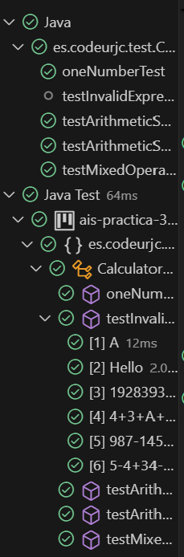

# CalculatorParser TDD

## Authors
- Alfonso Rodríguez Gutt.
- Marc Burgos Ucendo.

## Table of Contents
- [Expression with Only One Number](#tests-only-one-number)
- [Expression with Letters Test](#expression-with-letters-test)
- [Expression with Multiple Letters Test](#expression-with-multiple-letters-test)
- [Mix Numbers and Letters Test](#mix-numbers-and-letters-test)
- [Arithmetic Sum Test](#arithmetic-sum-test)
- [Invalid Arithmetic Sum Test](#invalid-arithmetic-sum-test)
- [Test Substraction](#tests-substraction)
- [Refactorization](#refactorization)

>[!NOTE]
> Since all tests are intended to test the functionality of a single method, the refactoring of both the tests and the parser method will be shown in a separate section, showing the refactorings together along with proof that all the tests pass.
## Tests Only One Number 

### Tests Only One Number 1

### Test Code

````java
 @Test
    public void TestOneNumber(){
        String operation = "1";

        int res = calculator.parse(operation);
        
        assertEquals(1, res);
    }
````
### Test Fail

### Minimun Functionality


### Every Test Pass


### Tests Only One Number 2

### Test Code
````java
 @Test
    public void TestOneNumber(){
        String operation = "2";

        int res = calculator.parse(operation);
        
        assertEquals(2, res);
    }
````
### Test Fail

### Minimun Functionality


### Every Test Pass


### Tests Only One Number 3

### Test Code
````java
 @Test
    public void TestOneNumber(){
        String operation = "3";

        int res = calculator.parse(operation);
        
        assertEquals(3, res);
    }
````
### Test Fail

### Minimun Functionality


### Every Test Pass


## Expression with Letters Test

### Test Code
````java
private static final String ERROR_MESSAGE = "The expression received is not a number.";
````

````java
@Test
@DisplayName("When receiving an expression with a letter, a NumberFormatException should be thrown")
public void singleLetterTest() {
      String operation = "A";
      NumberFormatException thrown = assertThrows(NumberFormatException.class, () -> {
          this.calculator.parse(operation);
      });
      assertEquals(ERROR_MESSAGE, thrown.getMessage());
}
````

### Test Error Message
```log
Unexpected exception type thrown, expected: <java.lang.NumberFormatException> but was: <java.lang.UnsupportedOperationException>
org.opentest4j.AssertionFailedError
````

### Minimun Functionality
```java
public int parse(String expression) {
      if ((expression.length() == 1) && (Character.isLetter(expression.charAt(0)))) {
          throw new NumberFormatException("The expression received is not a number.");
      }
      else {
          return Integer.parseInt(expression);
      }
}
````

### Every Test Pass


## Expression with Multiple Letters Test
### Test Code
```java
@Test
@DisplayName("When receiving an expression with multiple letters, a NumberFormatException should be thrown")
public void multipleLettersTest() {
      String operation = "Hello";
      NumberFormatException thrown = assertThrows(NumberFormatException.class, () -> {
            this.calculator.parse(operation);
      });
      assertEquals(ERROR_MESSAGE, thrown.getMessage());
}
````

### Test Error Message
```log
org.opentest4j.AssertionFailedError: expected: [The expression received is not a number.] but was: [For input string: "Hello"]
 at es.codeurjc.test.CalculatorParserTest.multipleLettersTest(CalculatorParserTest.java:44)
 at java.base/java.util.ArrayList.forEach(Unknown Source)
 at java.base/java.util.ArrayList.forEach(Unknown Source)
````
### Minimun Functionality
````java
public int parse(String expression) {
      if ((expression.length() == 1) && (Character.isLetter(expression.charAt(0)))) {
            throw new NumberFormatException("The expression received is not a number.");
      }
      else if ((expression.length() > 1) && (Character.isLetter(expression.charAt(0)))) {
            throw new NumberFormatException("The expression received is not a number.");
      }
      else {
            return Integer.parseInt(expression);
      }
}
````

### Test Pass


## Mix Numbers and Letters Test
### Test Code
```java
@Test
@DisplayName("When receiving an expression that mixes numbers and letters, a NumberFormatException should be thrown.")
public void mixNumbersAndLettersTest() {
      String operation = "19283939AB726X6";
      NumberFormatException thrown = assertThrows(NumberFormatException.class, () -> {
            this.calculator.parse(operation);
      });
      assertEquals(ERROR_MESSAGE, thrown.getMessage());
}
````

### Test Error Message
````log
org.opentest4j.AssertionFailedError: expected: [The expression received is not a number.] but was: [For input string: "19283939AB726X6"]
 at es.codeurjc.test.CalculatorParserTest.mixNumbersAndLettersTest(CalculatorParserTest.java:54)
 at java.base/java.util.ArrayList.forEach(Unknown Source)
 at java.base/java.util.ArrayList.forEach(Unknown Source)
````

### Minimun Functionality
````java
/**
 * Method that verifies if a given expression contains a letter.
 * @param expression said expression.
 * @return true if it does contains a letter, false otherwise.
 */
private boolean containsALetter(String expression) {
    for (char c : expression.toCharArray()) {
        if (Character.isLetter(c)) {
            return true;
        }
    }
    return false;
}
````


````java
public int parse(String expression) {
    if ((expression.length() == 1) && (Character.isLetter(expression.charAt(0)))) {
        throw new NumberFormatException("The expression received is not a number.");
    }
    else if ((expression.length() > 1) && (this.containsALetter(expression))) {
        throw new NumberFormatException("The expression received is not a number.");
    }
    else {
        return Integer.parseInt(expression);
    }
}
````
### Test Pass


## Arithmetic Sum Test
### Test Code
````java
@Test
@DisplayName("When receiving an arithmethic sum, the result of said sum should be returned")
public void arithmeticSumTest() {
    String operation = "5+3+6+8";
    assertEquals(22, this.calculator.parse(operation));
}
````
### Test Error Message
````log
java.lang.NumberFormatException: For input string: "5+3+6+8"
 at java.base/java.lang.NumberFormatException.forInputString(Unknown Source)
 at java.base/java.lang.Integer.parseInt(Unknown Source)
 at java.base/java.lang.Integer.parseInt(Unknown Source)
 at es.codeurjc.test.CalculatorParser.parse(CalculatorParser.java:27)
 at es.codeurjc.test.CalculatorParserTest.arithmeticSumTest(CalculatorParserTest.java:61)
 at java.base/java.util.ArrayList.forEach(Unknown Source)
 at java.base/java.util.ArrayList.forEach(Unknown Source)
````
### Minimun Functionality
```java
public int parse(String expression) {
    if ((expression.length() == 1) && (Character.isLetter(expression.charAt(0)))) {
          throw new NumberFormatException("The expression received is not a number.");
    }
    else if ((expression.length() > 1) && (this.containsALetter(expression))) {
          throw new NumberFormatException("The expression received is not a number.");
    }
    else {
          String[] numbers = expression.split("\\+");
          int sum = 0;
          for (String num : numbers) {
              sum = sum + Integer.parseInt(num.trim()); // Delete blank spaces.
          }
          return sum;
    }
}
````

### Test Pass


## Invalid Arithmetic Sum Test
### Test Code
````java
@Test
@DisplayName("When receiving an invalid format for an arithmethic sum, the result of said sum should be returned")
public void invalidAritmethicSumTest() {
    String operation = "4+3+A+7+C+88+BB";
    NumberFormatException thrown = assertThrows(NumberFormatException.class, () -> {
          this.calculator.parse(operation);
    });
    assertEquals(ERROR_MESSAGE, thrown.getMessage());
}
````

>[!NOTE]
> Since this case has been addressed in the [Expression with Multiple Letters Test](#expression-with-multiple-letters-test), the test passes without implementing any functionality.

### Test Pass


## Tests Substraction  

### Tests Substraction 1

### Test Code

````java
 @Test
    public void TestSubstractNumber1(){
        String operation = "5 - 3";

        int res = calculator.parse(operation);
        
        assertEquals(2, res);
    }
````
### Test Fail

### Minimun Functionality


### Every Test Pass


### Tests Substraction 2

### Test Code

````java
@Test
    public void TestSubstractNumber2(){
        String operation =  "1 - 2" ;

        int res = calculator.parse(operation);
        
        assertEquals(-1, res);
    }
````
### Test Fail

### Minimun Functionality


### Every Test Pass


### Tests Substraction 3

### Test Code

````java
 @Test
    public void TestSubstractNumber3(){
        String operation =  "7 - 2 - 1" ;

        int res = calculator.parse(operation);
        
        assertEquals(4, res);
    }
````
### Test Fail

### Minimun Functionality


### Every Test Pass


## Refactorization
Next, we will show the refactorings that were made in the `CalculatorParser` class and in `CalculatorParserTest`.
>[!NOTE]
> These refactorings were made using the AI ​​integrated into GitHub's Visual Studio as a tool.

### Invalid expressions Test
For this refactoring, all tests that were tasked with testing expressions containing one or more letters were grouped together. To achieve this, a Parameterized Test was used, where a single test can test various scenarios.

```java
@ParameterizedTest
@ValueSource(strings = {"A", "Hello", "19283939AB726X6", "4+3+A+7+C+88+BB", "987-145-A", "5-4+34-9+B-ABA"})
@DisplayName("Invalid expressions should throw NumberFormatException with correct message")
public void testInvalidExpressions(String operation) {
      NumberFormatException thrown = assertThrows(NumberFormatException.class, () -> {
            this.calculator.parse(operation);
      }); 
      assertEquals(ERROR_MESSAGE, thrown.getMessage(),"Exception message did not match expected.");
}
````

### Arithmetic Sum Test
In this refactoring, what was added was an additional check, where it was verified that a correctly formed expression did not throw the exception of type `NumberFormatException`.

```java
@Test
@DisplayName("Arithmetic sum should return correct result")
public void testArithmeticSum() {
      String operation = "5+3+6+8";
      assertDoesNotThrow(() -> {
            this.calculator.parse(operation);
      });
      assertEquals(22, calculator.parse(operation));
}
````

### Arithmetic Substraction Test
The same thing happens here as in the previous case.

```java
@Test
@DisplayName("Arithmetic subtraction should return correct result")
public void testArithmeticSubtraction() {
      String operation = "10-3-2";
      assertDoesNotThrow(() -> {
            this.calculator.parse(operation);
      });
      assertEquals(5, calculator.parse(operation));
}
````

### Mixed Operations Test
The same thing happens here as in the two previous cases.

```java
@Test
@DisplayName("Mixed operations (addition and subtraction) should return correct result")
public void testMixedOperations() {
      String operation = "10+5-2";
      assertDoesNotThrow(() -> {
            this.calculator.parse(operation);
      });
      assertEquals(13, calculator.parse(operation));
}
````

### Parser Method
For the main method, what was done was to reduce it (at the level of lines of code), making each case be treated with a specific method, in this way the size of the `parser` method is greatly reduced.

Below is the refactored `parser` method along with the helper methods that were implemented.

```java
public int parse(String expression) {
      if (containsInvalidCharacters(expression)) {
            throw new NumberFormatException("The expression received is not a number.");
      }
      return this.evaluateExpression(expression);
}
````

```java
/**
 * Checks if the expression contains invalid characters (letters).
 * @param expression The input expression.
 * @return true if invalid characters are found, false otherwise.
 */
private boolean containsInvalidCharacters(String expression) {
      return (expression.length() == 1 && Character.isLetter(expression.charAt(0))) 
            || (expression.length() > 1 && this.containsALetter(expression));
}
````

```java
/**
 * Evaluates an arithmetic expression with addition and subtraction.
 * Supports numbers separated by '+' or '-'.
 * @param expression A string containing integers with '+' or '-' symbols.
 * @return The computed result.
 * @throws NumberFormatException If any part cannot be parsed as an integer.
 */
private int evaluateExpression(String expression) {
      String[] tokens = expression.split("(?=[+-])"); // Split keeping '+'/'-' with numbers
      int result = 0;
      for (String token : tokens) {
            result += Integer.parseInt(token.trim()); // Convert and sum/subtract
      }
      return result;
}
```

### Test Pass



